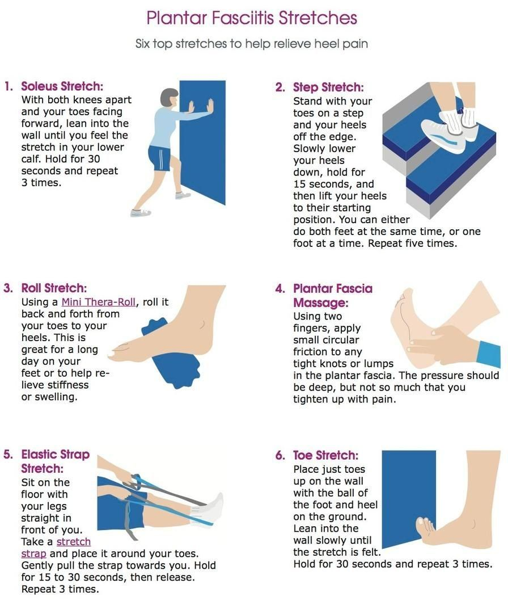

- Scott Sent me his notes on how to help with plantar fasciitis **Thanks Scott**
- Here is everything l know about living with plantar fasciitis. Hopefully, you won't need all this. The thing is, you can't know a priori what is going to help or not. You have to experiment. Here is what I've learned.
  title:: Plantar fasciitis
  
  Mayo Clinic article: [https://www.mayoclinic.org/diseases-conditions/plantar-fasciitis/symptoms-causes/syc-20354846](https://www.mayoclinic.org/diseases-conditions/plantar-fasciitis/symptoms-causes/syc-20354846)
  
  It might be worth consulting a podiatrist at some point.
  
  Stretching exercises:
  
  Stretching can help a lot if you remember to do it. I especially like the Soleus Stretch and the Step Stretch.  
  
  {:height 389, :width 376}
  [https://i.pinimg.com/originals/5a/fa/77/5afa77a0ea867c76710caa1f7edcfb09.jpg](https://i.pinimg.com/originals/5a/fa/77/5afa77a0ea867c76710caa1f7edcfb09.jpg)
  
  Shoes and Shoe Inserts:
  
  Having good shoes that give you a lot of support are really important. I was advised to get shoes with a thick sole, lots of support, a big toe box that is a little wider than your normal shoe size, and to go for a shoe that is a half to a full size larger. You may also want to consider having multiple pairs of shoes for different modalities.  I have a pair of athletic shoes for walking, a pair of outdoor shoes for general out of the house activities and a pair of slipper-like shoes for the indoors.  I have inserts in my indoor shoes.
  
  Here is a link to the walking shoes I have: [https://www.hoka.com/en/us/mens-road/gaviota-3/1113520.html](https://www.hoka.com/en/us/mens-road/gaviota-3/1113520.html).
  
  Anecdotally, I've heard that New Balance shoes can be good, but I haven't tried them.
  
  The other thing is inserts. These aren't always necessary, but they can turn mediocre shoes into usable ones and can extend the life of shoes you like. My podiatrist recommended (several years ago) this insert: [https://www.superfeet.com/en-us/blue](https://www.superfeet.com/en-us/blue) for me. I have tried other brands and products such as you find in CVS and they almost never work.
  
  One final thing, if you notice that your feet are hurting more for no apparent reason, it might be that you need new shoes. I have experienced this several times now.  My feet hurt. I buy new shoes. My feet don't hurt anymore.
  
  Socks and Sleeves:
  
  My podiatrist never mentioned these, but now I swear by them. Compression socks are just socks manufactured in a certain way to increase blood flow and restrict movement of the plantar fasciitis  Sleeves are like socks except that they are open toe and generally low-cut. Like shoes, you need different types of socks and sleeves depending on what you are doing. If you are moving around a lot or walking then high-compression socks work.  However, when you are more sedentary, the high-compression socks will start to hurt or cut off your circulation, so you might want to switch to low-compression sleeves.
  
  Here is a list of popular compression socks and sleeves: [https://www.plantarfasciitisresource.com/best-plantar-fasciitis-socks/](https://www.plantarfasciitisresource.com/best-plantar-fasciitis-socks/).  I prefer the Bitly sleeves for sedentary activity. I don't consider them tight and sometimes I can wear them while I'm sleeping.  I tried the popular SB Sox, but they are too tight around my ankle and aggravate a nerve on the top of my right foot, so I don't use them.  You may have a different outcome. I sometimes use the SB Sox Arch Sleeve.
  
  Sleeves:
  
  For sedentary tasks, light compression sleeves do the trick. I really like these: [https://www.shopbitly.com/collections/bitly-featured-products/products/white-plantar-fasciitis-socks](https://www.shopbitly.com/collections/bitly-featured-products/products/white-plantar-fasciitis-socks). Alternatively, the DS6 [https://os1st.com/products/ds6-decompression-foot-sleeve](https://os1st.com/products/ds6-decompression-foot-sleeve) works but it is much more expensive. Also, sometimes when my feet hurt while being sedentary, a higher compression sleeve (FS6) helps: [https://os1st.com/products/foot-compression-sleeve](https://os1st.com/products/foot-compression-sleeve).
  
  Compression Socks:
  
  For walking or general outdoor activity, I prefer these socks: [https://os1st.com/products/fs4-plantar-fasciitis-sock](https://os1st.com/products/fs4-plantar-fasciitis-sock). For a long time, I used the low top FS4 socks, but I accidentally bought the high top socks and I liked them even better.  They keep your feet warmer for one thing.
  
  Night Splints:
  
  If your feet ache when you wake up or are keeping you up at night, you might want to try a night splint. Night splints keep your feet at a 90 degree angle while you sleep. Here is a list of some night splints: [https://www.plantarfasciitisresource.com/best-plantar-fasciitis-night-splint/](https://www.plantarfasciitisresource.com/best-plantar-fasciitis-night-splint/).  I have had the best luck with the Strassburg Sock. I also bought a pair of night splints from CVS and these work OK too, but they are kind of bulky in bed.
  
  Alternatively, I sometimes wear the Bitly sleeves to bed and that can help.  Sometimes they bother me during the night and I have to take them off though.
  
  Drugs:
  
  Tylenol, Aleve and Ibuprofen can help.
  
  Well, as you can see, I've been dealing with this problem for a while.  I hope this helps now, or in the future.
  
  Good luck!
	-
	-
- Scott
-