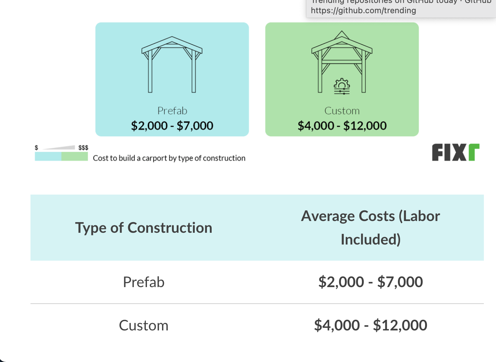
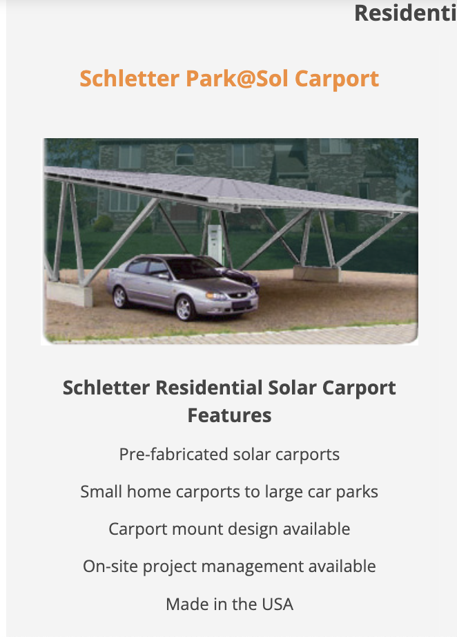
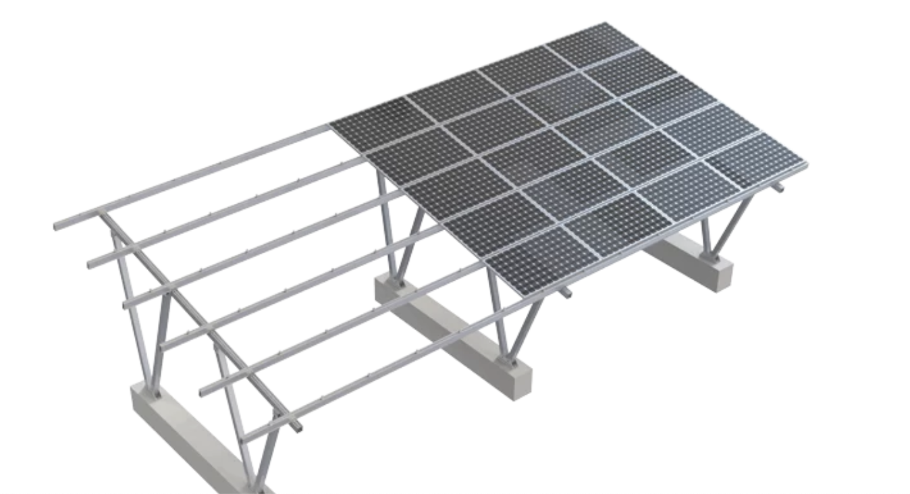
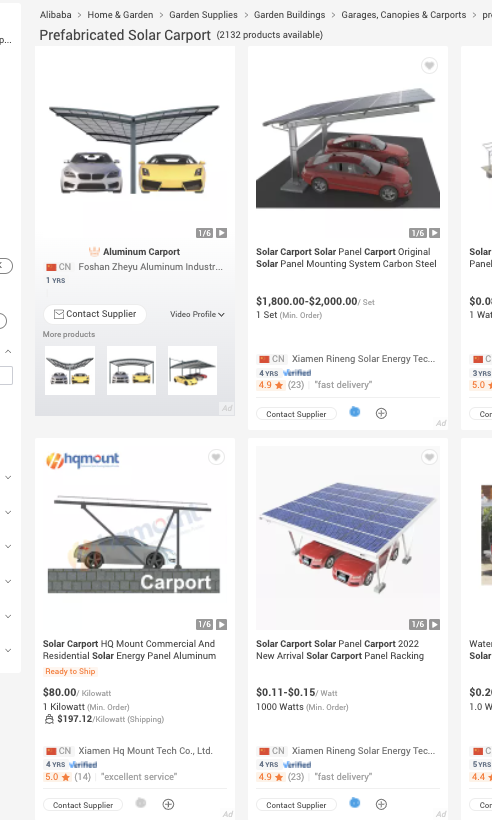
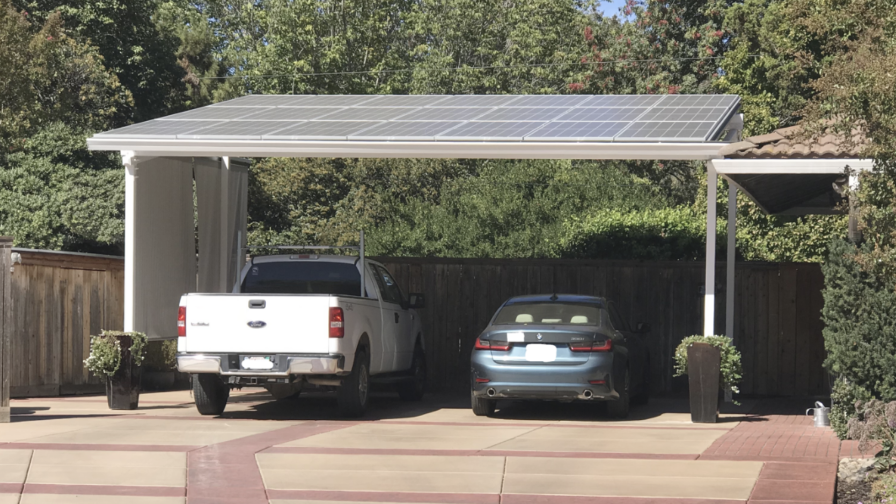
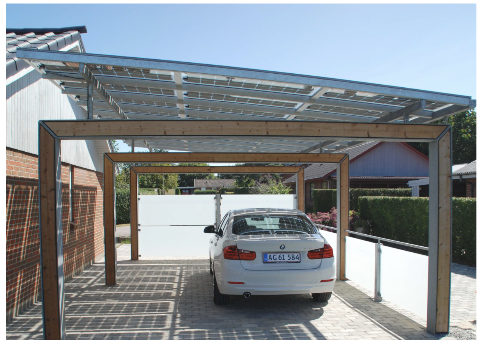
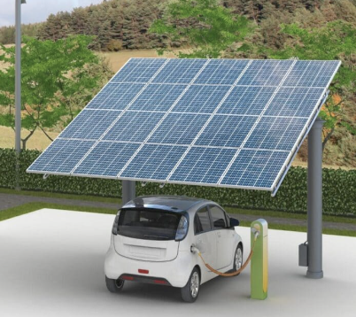

public:: true
title:: Solar/Solar Carport Notes

- {:height 288, :width 365}
- ^^^^^ The [Fixr](https://www.fixr.com/costs/build-carport#carport-cost-calculator) site - they have a cost calculator which guides you through options.
-
-
- {:height 452, :width 283}
- ^^^^^^^ from here [prefab solar carport](https://www.solarelectricsupply.com/residential-solar-systems/solar-carport-mounted)
- {:height 266, :width 393}
- ^^^^^^ from here [another prefab solar carport kit](https://www.symtechsolar.com/complete-solar-pv-systems/solar-carport-hercules/)
- {:height 619, :width 326}
- ^^^^^^ Direct from China [Alibaba](https://www.alibaba.com/showroom/prefabricated-solar-carport.html)
- {:height 292, :width 416}
- ^^^^^ maybe [here](https://solarcarportsdirect.com/residential/) ?
- {:height 229, :width 309}
- ^^^^^^^^ [diy](https://climatebiz.com/diy-solar-carport/)
  
  {:height 219, :width 174}
- [Solar carport guide](https://www.ecowatch.com/solar-carport-guide-2654668562.html)
- I want a 28 panel solar carport with 6 footings like this ((63d19e3b-45a5-472d-938f-ff4173a0c220)) from .  Solar Panel Mounting System Single Bay Carport Style – Fits up to 28 Panels
  $3,680.00 $2,149.00