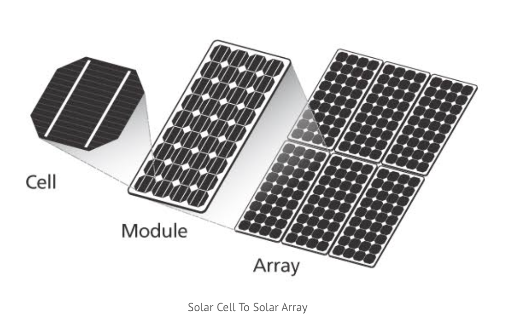

public:: true
title:: Solar/Solar Roof Notes

- [Cost](https://www.eia.gov/electricity/state/) of electricity by State
- Best Introduction to Solar [click here](https://www.cleanenergyreviews.info/solar-panels)
- [These](https://www.cleanenergyreviews.info/blog/most-powerful-solar-panels) are the most powerful Solar Arrays
- If not all solar is on roof then some or all on [[Solar/Solar Carport Notes]]
- Here is a [solar kit](https://www.google.com/shopping/product/434143281393975216?q=buy+solar+panels+with+micro+inverters&prds=epd:2426752309570714609,eto:2426752309570714609_0&sa=X&ved=0ahUKEwjFyYCSkZD4AhU_lnIEHcsfDgEQ9pwGCAs) for solar roof. [This](https://www.gogreensolar.com/products/13kw-diy-solar-panel-kit-sunspark-enphase) is the details
- My Solar Roof top SpreadSheet [here](https://docs.google.com/spreadsheets/d/15OzMvjN_9yyLq_VfnQaWiL0mXP83SCD5Z3ZAchzZLBE/edit?usp=sharing)
- BOM
  {:height 275, :width 377}
- solar [calculator](https://understandsolar.org/success_slfcalc/?&a=NSBOb3J0b24gUmQsIE1BLCAwMjQyMA==&f=NA&lsid=489&zip=02420&property_type=Single%20Family%20Home&ownership=Own&monthly_elec=250&shade=A%20Little%20Shade&lid=2046555&cpi=0&timeline=Ready&qb=5&direct=1)
- Venture Solar (Dillian)
- {{embed ((6287ba08-87ae-4c55-82b6-9fd06073465f))}}
- Sun Run
	- Danny Peter, paul was here
	- 3 programs
		- buy system
		- lease the system i.e. power purchase -> PPA 90% most ppl do this -> no cost program
			- needs to service system
		- redirection program ie loan own the system -> like a loan
			- equip and roof
	- Panels bought in bulk
	- We need to get energy from other states
	-
	- One meter
	- .25 center per killowat Eversource
	- .19  up 2.9 % per year
	- site survey
	-
	-
- [Solar Carport Guide](https://www.ecowatch.com/solar-carport-guide-2654668562.html)